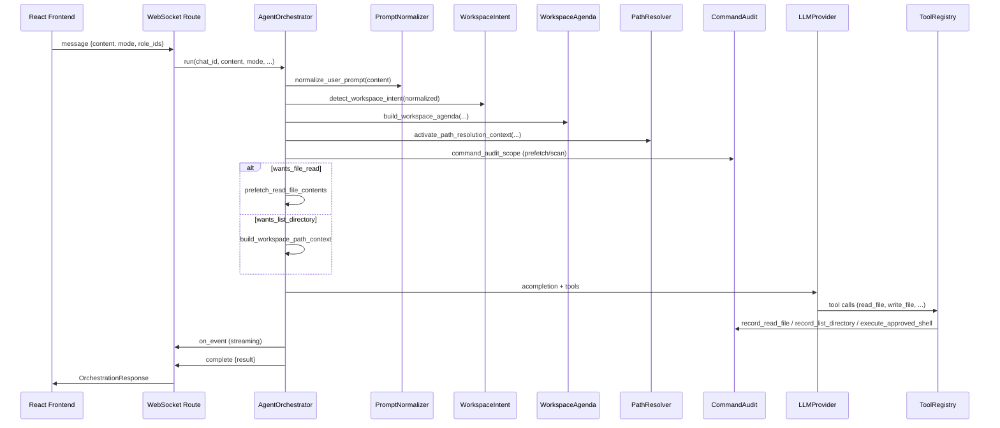

# AgentForge — Technical Documentation

> **Audience:** Developers and maintainers  
> **Last updated:** July 2026  
> **Stack:** Python 3.12 · FastAPI · React 18 · TypeScript · LiteLLM · SQLite

This document explains **how the code works internally**: which modules cooperate, in what order actions run, and which data structures are produced. It complements the [User Manual](USER_MANUAL.md) and the [README](../README.md).

---

## Table of Contents

1. [Overview](#1-overview)
2. [System Architecture](#2-system-architecture)
3. [Startup and Runtime Processes](#3-startup-and-runtime-processes)
4. [Request Flow (End-to-End)](#4-request-flow-end-to-end)
5. [AgentOrchestrator — Core Flow](#5-agentorchestrator--core-flow)
6. [Orchestration Modes](#6-orchestration-modes)
7. [Workspace Intent Detection](#7-workspace-intent-detection)
   - [7.1 Prompt Normalizer](#71-prompt-normalizer)
   - [7.2 Workspace Agenda](#72-workspace-agenda)
   - [7.3 Workspace Path Resolver](#73-workspace-path-resolver)
8. [Workspace Scanner and Executor](#8-workspace-scanner-and-executor)
9. [Task Board](#9-task-board)
10. [Command Audit (Mandatory Logging)](#10-command-audit-mandatory-logging)
11. [Tool Registry](#11-tool-registry)
12. [Multi-Agent Orchestration in Detail](#12-multi-agent-orchestration-in-detail)
13. [LLM Layer and Model Routing](#13-llm-layer-and-model-routing)
14. [Context Plugins](#14-context-plugins)
15. [Agent Roles](#15-agent-roles)
16. [Approval Manager (Shell Approvals)](#16-approval-manager-shell-approvals)
17. [Memory System](#17-memory-system)
18. [Storage and Persistence](#18-storage-and-persistence)
19. [Frontend Architecture](#19-frontend-architecture)
20. [REST API](#20-rest-api)
21. [WebSocket Protocol](#21-websocket-protocol)
22. [Security Model](#22-security-model)
23. [Tests and Quality Assurance](#23-tests-and-quality-assurance)
24. [File Structure](#24-file-structure)

---

## 1. Overview

AgentForge is a desktop AI platform for Linux (optional Tauri/browser) that:

- **Reads, writes, and lists files** in the configured workspace
- **Runs shell commands** with whitelist/blacklist policies and user approval
- **Orchestrates single- or multi-agent workflows** with specialized roles
- **Routes LLM requests** through LiteLLM to Ollama or cloud providers (OpenAI, Anthropic, Gemini, Groq, Mistral)
- **Streams real-time events** to the React UI over WebSocket

Core principle: every workspace action (read, write, list, shell) goes through controlled paths and is logged in **Command Audit**, so the UI “Console Commands” view is complete and auditable.

---

## 2. System Architecture

```
┌─────────────────────────────────────────────────────────────────┐
│                        Linux Desktop Host                        │
│  ┌──────────────┐    HTTP/WS     ┌──────────────────────────┐ │
│  │ React UI     │◄──────────────►│ FastAPI Backend          │ │
│  │ (Vite :5173) │                │ (uvicorn :8765)          │ │
│  └──────────────┘                │                          │ │
│         ▲                          │  AgentOrchestrator       │ │
│         │ Chromium/Tauri           │  ToolRegistry            │ │
│  ┌──────┴───────┐                  │  CommandAudit            │ │
│  │ run.py       │                  │  LLMProvider             │ │
│  └──────────────┘                  │  ApprovalManager         │ │
│                                    └────────────┬─────────────┘ │
└─────────────────────────────────────────────────┼───────────────┘
                                                  │
              ┌───────────────┬───────────────────┼───────────────┐
              │ SQLite DB     │ Ollama (remote)   │ Cloud LLM APIs  │
              │ ~/.local/     │ :11434            │ OpenAI, Claude… │
              │ share/        │                   │                 │
              │ agentforge    │                   │                 │
              └───────────────┴───────────────────┴─────────────────┘
```

### Backend Components (Quick Reference)

| Module | Path | Responsibility |
|--------|------|----------------|
| Main App | `agentforge/main.py` | FastAPI app, CORS, lifespan, static frontend in prod |
| Routes | `agentforge/api/routes.py` | REST + WebSocket |
| Config | `agentforge/config.py` | Pydantic settings from `.env` |
| Orchestrator | `agentforge/agents/orchestrator.py` | Quick/Single/Multi loops, tool rounds (mixins under `orchestrator_mixins/`) |
| Prompt Normalizer | `agentforge/agents/prompt_normalizer.py` | Typo/keyword correction before intent parsing |
| Workspace Agenda | `agentforge/agents/workspace_agenda.py` | Multi-step agenda (mkdir → write → read → edit) |
| Path Resolver | `agentforge/agents/workspace_path_resolver.py` | Canonical paths for tool calls |
| Workspace Intent | `agentforge/agents/workspace_intent.py` | Intent detection from user text |
| Task Board | `agentforge/agents/task_state.py` | Shared facts, plan steps, completion, UI payload |
| Workspace Scanner | `agentforge/agents/workspace_scanner.py` | Directory scan with audit |
| Workspace Executor | `agentforge/agents/workspace_executor.py` | File prefetch and deliverables |
| Command Audit | `agentforge/services/command_audit.py` | Mandatory logging of all commands |
| Role Registry | `agentforge/agents/role_registry.py` | 9 built-in + YAML roles |
| Approval Manager | `agentforge/agents/approval_manager.py` | Pending shell approvals |
| Tool Registry | `agentforge/tools/registry.py` | LLM tools (read/write/list/shell/…) |
| LLM Provider | `agentforge/llm/provider.py` | LiteLLM `acompletion` + tools |
| Model Router | `agentforge/llm/model_router.py` | Task type → model |
| Context Registry | `agentforge/context/registry.py` | Ambient plugins (weather, datetime, …) |
| Conversation Store | `agentforge/storage/conversation_store.py` | Chats, messages (SQLite) |
| Memory Store | `agentforge/memory/store.py` | Chat memory |

---

## 3. Startup and Runtime Processes

| Process | Port | Started by | Purpose |
|---------|------|------------|---------|
| uvicorn (FastAPI) | 8765 | `run.py` | REST, WebSocket, agent logic |
| Vite dev server | 5173 | `run.py` | React UI with HMR |
| Static frontend | 8765 | `run.py --prod` | Production: built UI served by backend |
| Chromium / Tauri | — | `run.py` | Desktop window |

**`run.py`** checks backend health, starts missing processes, opens the UI (`AGENTFORGE_MODE`: auto, browser, window, tauri). **`stop.py`** terminates PIDs and frees ports.

Backend entry: `python -m agentforge` → loads roles, context plugins, DB migrations, mounts `/api` routes.

---

## 4. Request Flow (End-to-End)

### 4.1 WebSocket (primary for chat)

1. Frontend connects to `WS /api/ws/chats/{chat_id}`.
2. User sends JSON with `content`, optional `mode`, `role_ids`, `llm`.
3. `routes.py` → `AgentOrchestrator.run(...)` with `on_event` callback.
4. During execution: events (`agent_start`, `tool_call`, `task_board_updated`, `shell_command_recorded`, …) to the client.
5. Completion: event `type: "complete"` with serialized `OrchestrationResponse`.

### 4.2 REST (synchronous)

`POST /api/chats/{id}/messages` — same orchestrator logic without streaming events (response in HTTP body).

### 4.3 Sequence Diagram (simplified)



---

## 5. AgentOrchestrator — Core Flow

Entry point: **`AgentOrchestrator.run()`** in `orchestrator.py`.

The class uses **mixins** under `agents/orchestrator_mixins/` (structure only, no behavior change):

| Mixin | File | Responsibility |
|-------|------|----------------|
| `ParsingMixin` | `parsing.py` | JSON tool calls in text, weak-content detection |
| `DeliverablesMixin` | `deliverables.py` | File materialization, agenda edits, prefetch |
| `ToolLoopMixin` | `tool_loop.py` | LLM tool loop, shell audit, approval resume |
| `MultiAgentMixin` | `multi_agent.py` | Multi rounds, parallel specialists |
| `SingleAgentMixin` | `single_agent.py` | Single/Quick modes |

Core logic (tool building, intent, task board, `run()`) remains in `orchestrator.py`.

### Step-by-Step

| Phase | What happens |
|-------|--------------|
| 1. Load chat | `conversation_store.get_chat(chat_id)` — mode, roles, memory, execution strategy |
| 2. Build tools | `_build_tools()` — ToolRegistry with approval callback |
| 3. Store user message | Optional `conversation_store.add_message(USER, …)` |
| 4. **Prompt Normalizer** | `normalize_user_prompt(user_content)` → corrected interpretation, UI metadata |
| 5. Readiness | `run_readiness_check()` — blocks if no model is ready |
| 6. Intent | `detect_workspace_intent(interpretation_content)` → `WorkspaceIntent` |
| 7. Task board | `load_task_board_memory()` + `build_task_state()` (agenda-based plan steps) |
| 8. Path resolver | `build_path_resolution_context()` + `activate_path_resolution_context()` |
| 9. Prefetch/scan | Inside `command_audit_scope`: prefetch files or scan directories |
| 10. Context | Ambient plugins **or** empty ambient context when `requires_tools` |
| 11. Mode | `_run_quick` / `_run_single` / `_run_multi` (mixins under `orchestrator_mixins/`) |
| 12. Persist | `persist_task_board(chat_id, task_state, on_event=…)` |
| 13. Return | `OrchestrationResponse` |

### Execution Strategy (Multi-Agent)

| Enum | Behavior |
|------|----------|
| `auto` | Resolved to `hybrid` |
| `serial` | Roles one after another |
| `parallel` | Mapped internally to `hybrid` |
| `hybrid` | Certain roles (Reviewer, Security, …) run in parallel within a round |

Single/Quick always force **`serial`**.

---

## 6. Orchestration Modes

Defined in `models/schemas.py` as `OrchestrationMode`:

| Mode | Enum value | Description |
|------|------------|-------------|
| **Quick** | `quick` | Fast reply without role tools; minimal context |
| **Single** | `single` | One role (auto-resolve or selected), full tool loop |
| **Multi** | `multi` | Multiple roles, PM synthesis, implementation phase, task board |

### Single-Agent Tool Loop

- Max. **8 tool rounds** (`MAX_TOOL_ROUNDS`)
- Per round: LLM → optional tool calls → results back to LLM
- Unknown tools → bailout with error message
- JSON tool calls in text are parsed as fallback

### Quick Mode

No full developer loop; suitable for short questions without workspace mutation.

---

## 7. Workspace Intent Detection

**File:** `agents/workspace_intent.py`

Analyzes the user message **before** the LLM call to detect workspace actions.

### WorkspaceIntent Fields

| Field | Meaning |
|-------|---------|
| `wants_file_creation` | Create or modify files |
| `wants_file_read` | Show file content (not write) |
| `wants_list_directory` | List directory |
| `wants_directory_creation` | Create folder |
| `wants_command_execution` | Shell command |
| `target_paths` / `target_dirs` | Resolved relative paths |
| `requires_tools` | True when any workspace action is active |

### Conflict Priority

**List intent takes precedence** over read/write keywords (e.g. “list files in src” is not misread as `read_file`).

### Prompt Addon

`build_prompt_addon()` appends precise instructions to the system prompt (e.g. “MUST use read_file”, “never only JSON”).

---

### 7.1 Prompt Normalizer

**File:** `agents/prompt_normalizer.py`

Runs **before** `detect_workspace_intent()`. Corrects typos in DE/EN workspace keywords and file extensions so weak Ollama models hit intent patterns reliably.

| Output | Usage |
|--------|-------|
| `normalized` | Text for intent, agenda, and path resolver |
| `corrections` | List of `{original, corrected, reason}` |
| `changed` | Whether corrections were applied |

Stored user messages include metadata (`prompt_corrections`, `interpreted_request`); the frontend shows a `prompt_normalized` WebSocket event and an “Interpreted as” block when the normalized text differs.

Tests: `tests/test_prompt_normalizer.py`

---

### 7.2 Workspace Agenda

**File:** `agents/workspace_agenda.py`

Breaks multi-step requests into a **numbered agenda** (1..N), e.g. create folder → write file → read → replace text.

| `AgendaAction` | Meaning |
|----------------|---------|
| `CREATE_DIRECTORY` | Create directory |
| `WRITE_FILE` | Write file |
| `READ_FILE` | Read file and show content |
| `EDIT_FILE` | Text replacement in existing file |

`build_workspace_agenda()` returns `AgendaStep` entries with `step_id`, `path`, `detail`, and optional `replace_from` / `replace_to`.

The agenda feeds `build_plan_from_agenda()` in `task_state.py` (task plan steps) and `_apply_agenda_edits()` in the orchestrator (deterministic edits after read-back).

Tests: `tests/test_workspace_agenda.py`

---

### 7.3 Workspace Path Resolver

**File:** `agents/workspace_path_resolver.py`

Maintains a **ContextVar context** during orchestration with canonical paths (planned deliverables, read targets, intent paths). When the LLM passes a wrong relative path to `read_file` / `write_file`, `resolve_workspace_path()` maps it to the correct canonical path.

| Function | Purpose |
|----------|---------|
| `build_path_resolution_context()` | Collects canonical paths from agenda/intent |
| `activate_path_resolution_context()` | Sets ContextVar for tool execution |
| `resolve_workspace_path()` | Called by `tools/registry.py` before file operations |
| `deactivate_path_resolution_context()` | Clears ContextVar in the `finally` block of `run()` |

Tests: `tests/test_workspace_path_resolver.py`

---

## 8. Workspace Scanner and Executor

### Workspace Scanner (`workspace_scanner.py`)

- Asynchronous directory listing
- Each scan → **`record_list_directory()`** in Command Audit
- Provides formatted context for prompts and task board

### Workspace Executor (`workspace_executor.py`)

- **`prefetch_read_file_contents()`** — loads files before the agent loop
- Each read → **`record_read_file()`** in Command Audit
- Errors are stored as `[ERROR] …` in facts
- HTML fallbacks embed quoted literal text from the user request (e.g. `"Hello World"`)

### Prefetch in Orchestrator

When `wants_file_read`:

1. Prefetch all target paths
2. `seed_read_facts(task_state, prefetched_reads)`
3. `build_read_context_block()` → `path_context` in prompt

When `wants_list_directory`:

1. `build_workspace_path_context()`
2. `seed_list_directory_facts(task_state, dir, listing)`

---

## 9. Task Board

**File:** `agents/task_state.py`

Shared state for multi-agent runs and completion checks.

### TaskType

| Type | Trigger |
|------|---------|
| `read_and_display` | Read intent |
| `write_files` | Write intent |
| `write_then_read` | Write then read |
| `workflow` | Create + read + edit compound requests |
| `list_directory` | List intent |
| `run_command` | Shell intent |
| `general` | Other |

### TaskFact

Verified information during orchestration:

- `source`, `kind`, `path`, `content`, `verified`, `agent_id`, `round_num`
- Duplicates with same `(source, path, kind)` are replaced

### Persistence

- Key: `_agentforge_task_board` in chat memory
- `load_task_board_memory()` / `persist_task_board()` via `memory_store`
- Also stores `interpreted_request` for follow-up turns
- Limits: max. 40 facts persisted, max. 12 in prompt

### Completion Check

Before final synthesis the orchestrator verifies all goals are met (e.g. missing files → weak retry, max. 2×).

For `TaskType.WORKFLOW`, the completion check uses the **`interpreted_request`** variant (after prompt normalizer) for agenda and edit steps — not the raw user text with typos.

### UI Snapshot

`build_task_board_ui_payload()` and `emit_task_board_update()` produce WebSocket event `task_board_updated` with numbered plan steps and status (`pending`, `active`, `done`). The React **`TaskBoardPanel`** renders this live in the chat.

### Seed Functions

| Function | When |
|----------|------|
| `seed_read_facts` | After prefetch |
| `seed_list_directory_facts` | After directory scan |
| `seed_write_facts` | After guaranteed file creation |
| `seed_edit_facts` | After agenda edit step |

---

## 10. Command Audit (Mandatory Logging)

**File:** `services/command_audit.py`

**Rule:** Every workspace and shell action must be logged. Direct calls to `run_shell_command()` are only allowed in `command_audit.py` and `shell_security.py` (enforced by tests).

### ContextVar Scope

```python
async with command_audit_scope(chat_id, agent_id, agent_name, on_event):
    # All record_* calls in this block use the context
```

### Logging Functions

| Function | Source | UI display |
|----------|--------|------------|
| `record_command` | Shell (general) | Console Commands |
| `record_read_file` | read_file tool / prefetch | Console Commands |
| `record_list_directory` | list_directory / scanner | Console Commands |
| `execute_approved_shell_command` | Approved shell command | Console Commands |

### WebSocket Events

| type | Meaning |
|------|---------|
| `shell_command_recorded` | Entry persisted (`entry` object) |
| `shell_command_pending` | Waiting for user approval |

Messages are stored as `MessageRole.TOOL` with `metadata.kind = "shell_command"` in SQLite.

---

## 11. Tool Registry

**File:** `tools/registry.py`

| Tool name | Class | Description |
|-----------|-------|-------------|
| `read_file` | ReadFileTool | Read text, PDF, or Word `.docx` (truncation via `max_output_chars`) |
| `write_file` | WriteFileTool | Write text, PDF, or Word `.docx`; create parent dirs |
| `list_directory` | ListDirectoryTool | Directory listing |
| `run_command` | ShellTool | Shell — **only** via Command Audit |
| `remember` | RememberTool | Fact in chat memory |
| `search_files` | SearchFilesTool | File search in workspace |
| `web_search` | WebSearchTool | Web search (when enabled) |

All paths are relative to **`AGENTFORGE_WORKSPACE_ROOT`**; path traversal is rejected.

**Document I/O:** `utils/document_io.py` handles `.pdf` and `.docx` via lazy-installed packages (`pypdf`, `python-docx`, `fpdf2`). `ReadFileTool`, `WriteFileTool`, and `read_workspace_file()` route document paths through these helpers; plain text files still use UTF-8 reads/writes.

### Tool Execution in Orchestrator

1. LLM returns `tool_calls`
2. Event `tool_call` to frontend
3. Registry executes → audit logging
4. Event `tool_result`
5. Result back to LLM for next round

---

## 12. Multi-Agent Orchestration in Detail

**Method:** `_run_multi()`

### Flow

1. Load roles (default: PM + Developer + Reviewer if empty)
2. PM is always inserted if missing
3. `_order_roles_for_intent()` — intent-based order
4. Task plan in transcript
5. **`_ensure_requested_files()`** — implementation phase for write intents
6. Prefetch reads into transcript
7. **Round loop** (`max_multi_rounds`, configurable for Ollama)
   - Per role: `_run_multi_role_turn()`
   - Parallel batches for Reviewer/Security/Tester with `hybrid`
   - `[ASK_USER]` → user-choice modal (`agent_question`) or deliverable guarantee
8. PM synthesis / final response
9. Weak-content retries on incomplete answers

### Special Cases

- Skip Developer in round 0 after implementation phase
- Write intent + `[ASK_USER]`: `_guarantee_workspace_deliverables()` still tries to write files
- User interventions via `intervention_queue` during active orchestration

---

## 13. LLM Layer and Model Routing

### LLMProvider (`llm/provider.py`)

- Wrapper around LiteLLM `acompletion()`
- Supports streaming (`content_delta` events)
- Tool schemas in OpenAI format

### Model Router (`llm/model_router.py`)

1. Auto-routing off? → `default_model`
2. Detect task type from user content + role
3. User registry assignment
4. Fallback: `assets/models.yaml`
5. Ollama tag verification

### Cloud Providers (`llm/cloud_providers.py`)

API keys from settings; prefixes: `openai/`, `anthropic/`, `gemini/`, `groq/`, `mistral/`.

Event `model_selected` informs the frontend about the chosen model.

---

## 14. Context Plugins

**Registry:** `context/registry.py`

Ambient context plugins (only when **no** active workspace tool intent):

| Plugin | Content |
|--------|---------|
| datetime | Current time |
| weather | Weather (location/IP) |
| sun_times | Sunrise/sunset |
| holidays | Public holidays |
| exchange_rates | Exchange rates |
| country_facts / random_fact | Static facts |

Events: `context_plugin_start`, `context_plugin_complete`.

When `workspace_intent.requires_tools == True`, **`_ambient_context` is cleared** — workspace context takes priority.

---

## 15. Agent Roles

**9 built-in roles** in `role_registry.py`:

| ID | Name | Focus |
|----|------|-------|
| `developer` | Developer | Write code, use tools |
| `reviewer` | Reviewer | Code review |
| `architect` | Architect | System design |
| `researcher` | Researcher | Research |
| `documentation` | Documentation | Docs/README |
| `project_manager` | Project Manager | Coordination, synthesis |
| `software_tester` | Software Tester | QA, tests |
| `security` | Security Engineer | Security review |
| `devops` | DevOps Engineer | CI/CD, deployment |

Custom roles: YAML/JSON in `assets/roles/`. The Settings UI (**Agents** tab) lists built-in and custom roles separately. Custom roles can be created, edited, or deleted from the UI; changes are persisted as `{id}.yaml` files and loaded on the next backend start (or immediately in the running registry).

**API:**

| Method | Path | Description |
|--------|------|-------------|
| GET | `/api/roles` | List all roles (localized built-in names) |
| POST | `/api/roles` | Create custom role |
| PUT | `/api/roles/{id}` | Update custom role |
| DELETE | `/api/roles/{id}` | Delete custom role |

Single mode: `resolve_single_role()` picks role from text or default `developer`.

---

## 16. Approval Manager and User-Choice Dialogs

**Files:** `agents/approval_manager.py`, `agents/user_clarification.py`, `agents/orchestrator_mixins/clarification.py`

### Shell command approvals

Shell commands go through `shell_security.classify_shell_command()`:

| Policy | Examples | Action |
|--------|----------|--------|
| Whitelist | `git`, `npm`, `python`, `ls`, `grep` | Auto-run |
| Blacklist | `rm`, `sudo`, `curl`, `ssh` | Blocked |
| Unlisted | Other | User approval required |

Pending approvals: `GET /api/chats/{id}/approvals`  
Approve: `POST /api/chats/{id}/approvals/{aid}`

The inline **`ApprovalPanel`** handles binary approve/deny for shell commands.

### User-choice clarification (`action_type: user_choice`)

When the orchestrator cannot proceed deterministically, it pauses and opens a modal **`UserChoiceDialog`** (WebSocket event `user_choice_pending`).

| Kind | Trigger | Typical options |
|------|---------|-----------------|
| `missing_content_tag` | Agenda write expects `<h2>` but only `<h3>` exists | Use alternate tag, skip step, abort |
| `agent_blocked` | Weak agent output after max retries | Retry, custom reply, abort |
| `agent_question` | Agent output with `[ASK_USER]` | Custom reply, retry, abort |
| `workflow_incomplete` | Compound workflow missing deliverables | Retry, skip, custom reply, abort |

**Resume states:**

- `AgendaResumeState` — continue `_execute_workspace_agenda_pipeline()` from saved step index (updates task board via `persist_task_board()` + `task_board_updated`)
- `OrchestrationResumeState` — re-run orchestration with user comment injected

Read-only prompts with prefetch errors skip clarification escalation; the final answer quotes the `[ERROR]` text instead.

---

## 17. Memory System

**File:** `memory/store.py`

- Per-chat configurable: token budget, enabled/disabled
- Scope is currently **always `chat`** (validator enforces this)
- `remember` tool stores facts
- Task board uses separate memory key `_agentforge_task_board`

---

## 18. Storage and Persistence

### Data Directory

Default: `~/.local/share/agentforge/`

| File | Content |
|------|---------|
| `agentforge.db` | Chats, messages, memory |
| `model_config.json` | Model registry, routing |
| `setup_state.json` | Setup wizard state |

### Runtime (Project)

| Path | Content |
|------|---------|
| `.run/backend.pid` | Backend PID |
| `.run/logs/*.log` | Launcher/backend/frontend logs |
| `backend/.env` | Local secrets (do not commit) |

---

## 19. Frontend Architecture

| Area | Path | Description |
|------|------|-------------|
| Entry | `src/App.tsx` | Layout, modals, chat routing |
| Chat | `src/components/ChatPanel.tsx` | Messages, WebSocket, approvals, task board |
| Task Board | `src/components/TaskBoardPanel.tsx` | Live plan steps from `task_board_updated` |
| Sidebar | `src/components/Sidebar.tsx` | Chat list, keyboard (Del, ↑/↓) |
| Command History | `src/components/CommandHistoryModal.tsx` | Console Commands from audit |
| Context Plugins | `src/components/ContextPluginLog.tsx` | Plugin events |
| API | `src/services/api.ts` | REST client |
| Shell utils | `src/utils/shellCommands.ts` | Parsing command entries |
| Task board utils | `src/utils/taskBoard.ts` | Parse WebSocket task board payload |
| i18n | `src/i18n/locales/{en,de}.json` | UI translations (app UI only; docs are English) |

The WebSocket handler in `ChatPanel` processes all `type` events and updates local state.

---

## 20. REST API

Base URL: `http://127.0.0.1:8765/api`

Key endpoints (full list in HTML doc):

- **Health/Settings:** `GET/POST /settings`, `GET /health`
- **Setup:** `/setup/status`, `/setup/test`, `/setup/complete`, …
- **Roles:** `GET/POST/PUT/DELETE /roles`
- **LLM:** `/llm/models`, `/llm/routing`, `/llm/registry`, …
- **Chats:** CRUD `/chats`, messages `/chats/{id}/messages`
- **Approvals:** `/chats/{id}/approvals`

Production: `python3 run.py --prod` serves the built UI from the same host/port (`AGENTFORGE_PROD=1`).

---

## 21. WebSocket Protocol

**Endpoint:** `WS /api/ws/chats/{chat_id}`

### Client → Server

```json
{
  "type": "message",
  "content": "List files in src/",
  "mode": "multi",
  "role_ids": ["developer", "reviewer"]
}
```

Other client types: `stop`, `intervention` (live input during orchestration).

### Server → Client (Events)

| type | Description |
|------|-------------|
| `agent_start` | Agent begins turn |
| `agent_end` | Agent ends turn |
| `agent_message` | Multi-agent discussion entry |
| `role_resolved` | Auto role selection (Single) |
| `prompt_normalized` | Prompt corrections (normalizer) |
| `task_board_updated` | Task plan steps and status |
| `model_selected` | Selected LLM model |
| `content_delta` | Streaming text |
| `tool_call` | Tool call started |
| `tool_result` | Tool result |
| `shell_command_recorded` | Audit entry |
| `shell_command_pending` | Approval required |
| `context_plugin_start` / `context_plugin_complete` | Ambient plugin |
| `user_intervention` / `user_message` | Live user input |
| **`complete`** | **Orchestration finished** (with `result`) |
| `stopped` | Cancelled |
| `error` | Error with `message` |

> **Note:** The completion event is `complete`, not `done`. Modes are `quick`, `single`, `multi` — not `coding` / `multi_agent`.

---

## 22. Security Model

1. **Workspace sandbox** — paths only under `workspace_root`
2. **Shell policy** — whitelist / blacklist / approval
3. **Command audit** — no silent execution; everything logged
4. **API keys** — masked in settings API; stored locally in DB/`.env`
5. **Network** — backend defaults to `127.0.0.1`

---

## 23. Tests and Quality Assurance

### Quality Test Suite

```bash
./scripts/run-quality-tests.sh
```

Includes:

| Module | Focus |
|--------|-------|
| `test_command_audit_mandatory.py` | Mandatory audit for ls, read, list, shell |
| `test_prompt_intent_matrix.py` | Intent detection (parametrized) |
| `test_prompt_orchestration_outcomes.py` | E2E orchestration (mocked LLM) |
| `test_prompt_compound_outcomes.py` | Compound prompts: typos, wrong paths, workflow |
| `test_prompt_task_board_outcomes.py` | Task board unit tests |
| `test_prompt_path_extraction.py` | Path extraction regression |
| `test_prompt_normalizer.py` | Prompt normalizer |
| `test_workspace_agenda.py` | Workspace agenda (multi-step workflows) |
| `test_workspace_path_resolver.py` | Path resolver / canonical paths |

Markers in `pytest.ini`: `audit`, `quality`

### CI

`.github/workflows/quality-tests.yml` — three jobs:

| Job | Content |
|-----|---------|
| `backend-quality` | `./scripts/run-quality-tests.sh` |
| `backend-pytest-full` | Full pytest suite (excluding live Ollama) |
| `frontend-tests` | Vitest unit + Playwright E2E smoke |

### Frontend Tests

```bash
cd frontend
npm run test:unit    # Vitest
npm run test:e2e     # Playwright (UI smoke, Vite dev server)
```

### Standard Tests

```bash
python3 run_tests.py          # Unit (mocked)
python3 run_tests.py --live   # + Ollama integration
```

---

## 24. File Structure

```
agent-forge/
├── run.py / stop.py / install.py
├── scripts/run-quality-tests.sh
├── backend/
│   ├── agentforge/
│   │   ├── main.py
│   │   ├── config.py
│   │   ├── api/routes.py
│   │   ├── agents/
│   │   │   ├── orchestrator.py      # Core orchestration
│   │   │   ├── orchestrator_mixins/ # Parsing, tool loop, single/multi, deliverables
│   │   │   ├── prompt_normalizer.py
│   │   │   ├── workspace_agenda.py
│   │   │   ├── workspace_path_resolver.py
│   │   │   ├── workspace_intent.py
│   │   │   ├── task_state.py
│   │   │   ├── workspace_scanner.py
│   │   │   ├── workspace_executor.py
│   │   │   ├── role_registry.py
│   │   │   └── approval_manager.py
│   │   ├── services/command_audit.py
│   │   ├── tools/registry.py
│   │   ├── llm/
│   │   ├── context/
│   │   ├── memory/
│   │   └── storage/
│   └── tests/
├── frontend/src/
├── docs/
│   ├── TECHNICAL_DOCUMENTATION.md   # This file
│   ├── TECHNICAL_DOCUMENTATION.html
│   ├── REMOTE_OLLAMA.md
│   └── USER_MANUAL.md
└── assets/roles/                    # Custom YAML roles
```

---

## See Also

- HTML version (browser): [TECHNICAL_DOCUMENTATION.html](TECHNICAL_DOCUMENTATION.html)
- User manual: [USER_MANUAL.md](USER_MANUAL.md)
- Remote Ollama: [REMOTE_OLLAMA.md](REMOTE_OLLAMA.md)
- Installation: [README](../README.md)
