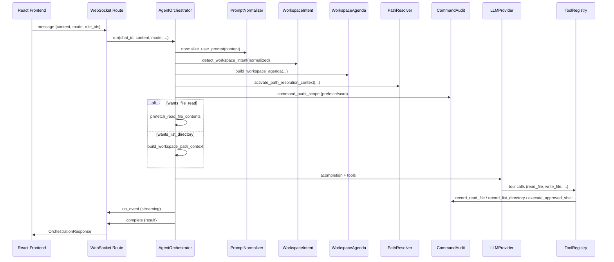

# AgentForge — Technische Dokumentation

> **Zielgruppe:** Entwickler und Maintainer  
> **Stand:** Juli 2026  
> **Stack:** Python 3.12 · FastAPI · React 18 · TypeScript · LiteLLM · SQLite

Diese Dokumentation beschreibt **wie der Code intern funktioniert**: welche Module zusammenarbeiten, in welcher Reihenfolge Aktionen ablaufen, und welche Datenstrukturen dabei entstehen. Sie ergänzt das [Benutzerhandbuch](USER_MANUAL.md) und die [README](../README.md).

---

## Inhaltsverzeichnis

1. [Überblick](#1-überblick)
2. [Systemarchitektur](#2-systemarchitektur)
3. [Startup und Laufzeitprozesse](#3-startup-und-laufzeitprozesse)
4. [Anfragefluss (End-to-End)](#4-anfragefluss-end-to-end)
5. [AgentOrchestrator — zentraler Ablauf](#5-agentorchestrator--zentraler-ablauf)
6. [Orchestrierungsmodi](#6-orchestrierungsmodi)
7. [Workspace Intent Detection](#7-workspace-intent-detection)
   - [7.1 Prompt Normalizer](#71-prompt-normalizer)
   - [7.2 Workspace Agenda](#72-workspace-agenda)
   - [7.3 Workspace Path Resolver](#73-workspace-path-resolver)
8. [Workspace Scanner und Executor](#8-workspace-scanner-und-executor)
9. [Task Board (Schwarzes Brett)](#9-task-board-schwarzes-brett)
10. [Command Audit (Pflicht-Protokollierung)](#10-command-audit-pflicht-protokollierung)
11. [Tool Registry](#11-tool-registry)
12. [Multi-Agent-Orchestrierung im Detail](#12-multi-agent-orchestrierung-im-detail)
13. [LLM-Schicht und Modell-Routing](#13-llm-schicht-und-modell-routing)
14. [Context Plugins](#14-context-plugins)
15. [Agent-Rollen](#15-agent-rollen)
16. [Approval Manager (Shell-Freigaben)](#16-approval-manager-shell-freigaben)
17. [Memory-System](#17-memory-system)
18. [Storage und Persistenz](#18-storage-und-persistenz)
19. [Frontend-Architektur](#19-frontend-architektur)
20. [REST API](#20-rest-api)
21. [WebSocket-Protokoll](#21-websocket-protokoll)
22. [Sicherheitsmodell](#22-sicherheitsmodell)
23. [Tests und Qualitätssicherung](#23-tests-und-qualitätssicherung)
24. [Dateistruktur](#24-dateistruktur)

---

## 1. Überblick

AgentForge ist eine Desktop-KI-Plattform für Linux (optional Tauri/Browser), die:

- **Dateien** im konfigurierten Workspace liest, schreibt und Verzeichnisse auflistet
- **Shell-Befehle** mit Whitelist/Blacklist und Benutzerfreigabe ausführt
- **Einzel- oder Multi-Agent-Orchestrierung** mit spezialisierten Rollen durchführt
- **LLM-Anfragen** über LiteLLM an Ollama oder Cloud-Provider (OpenAI, Anthropic, Gemini, Groq, Mistral) routet
- **Echtzeit-Events** über WebSocket an die React-UI streamt

Kernprinzip: Jede Workspace-Aktion (Lesen, Schreiben, Auflisten, Shell) läuft über kontrollierte Pfade und wird im **Command Audit** protokolliert, damit die UI „Console Commands“ vollständig und nachvollziehbar ist.

---

## 2. Systemarchitektur

```
┌─────────────────────────────────────────────────────────────────┐
│                        Linux Desktop Host                        │
│  ┌──────────────┐    HTTP/WS     ┌──────────────────────────┐ │
│  │ React UI     │◄──────────────►│ FastAPI Backend          │ │
│  │ (Vite :5173) │                │ (uvicorn :8765)          │ │
│  └──────────────┘                │                          │ │
│         ▲                          │  AgentOrchestrator       │ │
│         │ Chromium/Tauri           │  ToolRegistry            │ │
│  ┌──────┴───────┐                  │  CommandAudit            │ │
│  │ run.py       │                  │  LLMProvider             │ │
│  └──────────────┘                  │  ApprovalManager         │ │
│                                    └────────────┬─────────────┘ │
└─────────────────────────────────────────────────┼───────────────┘
                                                  │
              ┌───────────────┬───────────────────┼───────────────┐
              │ SQLite DB     │ Ollama (remote)   │ Cloud LLM APIs  │
              │ ~/.local/     │ :11434            │ OpenAI, Claude… │
              │ share/        │                   │                 │
              │ agentforge    │                   │                 │
              └───────────────┴───────────────────┴─────────────────┘
```

### Backend-Komponenten (Kurzreferenz)

| Modul | Pfad | Verantwortung |
|-------|------|---------------|
| Main App | `agentforge/main.py` | FastAPI-App, CORS, Lifespan |
| Routes | `agentforge/api/routes.py` | REST + WebSocket |
| Config | `agentforge/config.py` | Pydantic-Settings aus `.env` |
| Orchestrator | `agentforge/agents/orchestrator.py` | Quick/Single/Multi-Loops, Tool-Runden (Mixin-Module unter `orchestrator_mixins/`) |
| Prompt Normalizer | `agentforge/agents/prompt_normalizer.py` | Rechtschreib-/Typo-Korrektur vor Intent-Parsing |
| Workspace Agenda | `agentforge/agents/workspace_agenda.py` | Mehrschritt-Agenda (mkdir → write → read → edit) |
| Path Resolver | `agentforge/agents/workspace_path_resolver.py` | Kanonische Pfade für Tool-Aufrufe |
| Workspace Intent | `agentforge/agents/workspace_intent.py` | Intent-Erkennung aus User-Text |
| Task Board | `agentforge/agents/task_state.py` | Schwarzes Brett, Facts, Completion |
| Workspace Scanner | `agentforge/agents/workspace_scanner.py` | Verzeichnis-Scan mit Audit |
| Workspace Executor | `agentforge/agents/workspace_executor.py` | Prefetch von Dateiinhalten |
| Command Audit | `agentforge/services/command_audit.py` | Pflicht-Logging aller Befehle |
| Role Registry | `agentforge/agents/role_registry.py` | 9 Built-in + YAML-Rollen |
| Approval Manager | `agentforge/agents/approval_manager.py` | Pending Shell-Freigaben |
| Tool Registry | `agentforge/tools/registry.py` | LLM-Tools (read/write/list/shell/…) |
| LLM Provider | `agentforge/llm/provider.py` | LiteLLM `acompletion` + Tools |
| Model Router | `agentforge/llm/model_router.py` | Task-Typ → Modell |
| Context Registry | `agentforge/context/registry.py` | Ambiente Plugins (Wetter, Datum, …) |
| Conversation Store | `agentforge/storage/conversation_store.py` | Chats, Messages (SQLite) |
| Memory Store | `agentforge/memory/store.py` | Chat-Memory |

---

## 3. Startup und Laufzeitprozesse

| Prozess | Port | Gestartet von | Zweck |
|---------|------|---------------|-------|
| uvicorn (FastAPI) | 8765 | `run.py` | REST, WebSocket, Agent-Logik |
| Vite Dev Server | 5173 | `run.py` | React-UI mit HMR |
| Static frontend | 8765 | `run.py --prod` | Produktion: gebautes UI vom Backend |
| Chromium / Tauri | — | `run.py` | Desktop-Fenster |

**`run.py`** prüft Backend-Gesundheit, startet fehlende Prozesse, öffnet die UI (`AGENTFORGE_MODE`: auto, browser, window, tauri). **`stop.py`** beendet PIDs und gibt Ports frei.

Backend-Einstieg: `python -m agentforge` → lädt Rollen, Context-Plugins, DB-Migrationen, mountet `/api`-Routes.

---

## 4. Anfragefluss (End-to-End)

### 4.1 WebSocket (primär für Chat)

1. Frontend verbindet sich mit `WS /api/ws/chats/{chat_id}`.
2. User sendet JSON mit `content`, optional `mode`, `role_ids`, `llm`.
3. `routes.py` → `AgentOrchestrator.run(...)` mit `on_event`-Callback.
4. Während der Ausführung: Events (`agent_start`, `tool_call`, `shell_command_recorded`, …) an den Client.
5. Abschluss: Event `type: "complete"` mit serialisiertem `OrchestrationResponse`.

### 4.2 REST (synchron)

`POST /api/chats/{id}/messages` — gleiche Orchestrator-Logik, aber ohne Streaming-Events (Antwort im HTTP-Body).

### 4.3 Sequenzdiagramm (vereinfacht)



---

## 5. AgentOrchestrator — zentraler Ablauf

Einstiegspunkt: **`AgentOrchestrator.run()`** in `orchestrator.py`.

Die Klasse nutzt **Mixins** unter `agents/orchestrator_mixins/` (kein Verhaltenswechsel, nur Struktur):

| Mixin | Datei | Verantwortung |
|-------|-------|---------------|
| `ParsingMixin` | `parsing.py` | JSON-Tool-Calls im Text, Weak-Content-Erkennung |
| `DeliverablesMixin` | `deliverables.py` | Datei-Materialisierung, Agenda-Edits, Prefetch |
| `ToolLoopMixin` | `tool_loop.py` | LLM-Tool-Schleife, Shell-Audit, Approval-Resume |
| `MultiAgentMixin` | `multi_agent.py` | Multi-Runden, parallele Spezialisten |
| `SingleAgentMixin` | `single_agent.py` | Single/Quick-Modi |

Kernlogik (Tools bauen, Intent, Task Board, `run()`) bleibt in `orchestrator.py`.

### Schritt-für-Schritt

| Phase | Was passiert |
|-------|--------------|
| 1. Chat laden | `conversation_store.get_chat(chat_id)` — Modus, Rollen, Memory, Execution Strategy |
| 2. Tools bauen | `_build_tools()` — ToolRegistry mit Approval-Callback |
| 3. User-Message speichern | Optional `conversation_store.add_message(USER, …)` |
| 4. **Prompt Normalizer** | `normalize_user_prompt(user_content)` → korrigierte Interpretation, Metadaten fürs UI |
| 5. Readiness | `run_readiness_check()` — blockiert wenn kein Modell bereit |
| 6. Intent | `detect_workspace_intent(interpretation_content)` → `WorkspaceIntent` |
| 7. Task Board | `load_task_board_memory()` + `build_task_state()` (Agenda-basierte Plan-Schritte) |
| 8. Path Resolver | `build_path_resolution_context()` + `activate_path_resolution_context()` |
| 9. Prefetch/Scan | Innerhalb `command_audit_scope`: Dateien vorladen oder Verzeichnis scannen |
| 10. Context | Ambiente Plugins **oder** leerer Ambient-Context bei `requires_tools` |
| 11. Modus | `_run_quick` / `_run_single` / `_run_multi` (Mixins unter `orchestrator_mixins/`) |
| 12. Persist | `persist_task_board(chat_id, task_state)` |
| 13. Return | `OrchestrationResponse` |

### Execution Strategy (Multi-Agent)

| Enum | Verhalten |
|------|-----------|
| `auto` | Wird zu `hybrid` aufgelöst |
| `serial` | Rollen nacheinander |
| `parallel` | Wird intern zu `hybrid` gemappt |
| `hybrid` | Bestimmte Rollen (Reviewer, Security, …) parallel in einer Runde |

Single/Quick erzwingen immer **`serial`**.

---

## 6. Orchestrierungsmodi

Definiert in `models/schemas.py` als `OrchestrationMode`:

| Modus | Enum-Wert | Beschreibung |
|-------|-----------|--------------|
| **Quick** | `quick` | Schnelle Antwort ohne Rollen-Tools; minimaler Kontext |
| **Single** | `single` | Eine Rolle (auto-resolve oder gewählt), volle Tool-Schleife |
| **Multi** | `multi` | Mehrere Rollen, PM-Synthese, Implementierungs-Phase, Task Board |

### Single-Agent Tool-Schleife

- Max. **8 Tool-Runden** (`MAX_TOOL_ROUNDS`)
- Pro Runde: LLM → optional Tool-Calls → Ergebnisse zurück an LLM
- Unbekannte Tools → Bailout mit Fehlermeldung
- JSON-Tool-Calls im Text werden als Fallback geparst

### Quick-Modus

Kein vollständiger Developer-Loop; geeignet für kurze Fragen ohne Workspace-Mutation.

---

## 7. Workspace Intent Detection

**Datei:** `agents/workspace_intent.py`

Analysiert die User-Nachricht **vor** dem LLM-Aufruf, um Workspace-Aktionen zu erkennen.

### WorkspaceIntent-Felder

| Feld | Bedeutung |
|------|-----------|
| `wants_file_creation` | Datei anlegen/ändern |
| `wants_file_read` | Dateiinhalt anzeigen (nicht schreiben) |
| `wants_list_directory` | Verzeichnis auflisten |
| `wants_directory_creation` | Ordner anlegen |
| `wants_command_execution` | Shell-Befehl |
| `target_paths` / `target_dirs` | Aufgelöste relative Pfade |
| `requires_tools` | True wenn irgendeine Workspace-Aktion aktiv |

### Priorität bei Konflikten

**Listen-Intent hat Vorrang** vor Lese-/Schreib-Keywords (z. B. „list files in src“ wird nicht als `read_file` missinterpretiert).

### Prompt-Addon

`build_prompt_addon()` hängt dem System-Prompt präzise Anweisungen an (z. B. „MUST use read_file“, „never only JSON“).

---

### 7.1 Prompt Normalizer

**Datei:** `agents/prompt_normalizer.py`

Läuft **vor** `detect_workspace_intent()`. Korrigiert Tippfehler in DE/EN Workspace-Keywords und Dateiendungen, damit schwache Ollama-Modelle Intent-Patterns zuverlässig treffen.

| Ausgabe | Verwendung |
|---------|------------|
| `normalized` | Text für Intent, Agenda und Path Resolver |
| `corrections` | Liste `{original, corrected, reason}` |
| `changed` | Ob Korrekturen angewendet wurden |

Bei gespeicherten User-Messages werden Metadaten (`prompt_corrections`, `interpreted_request`) persistiert; das Frontend kann ein `prompt_normalized`-WebSocket-Event anzeigen.

Tests: `tests/test_prompt_normalizer.py`

---

### 7.2 Workspace Agenda

**Datei:** `agents/workspace_agenda.py`

Zerlegt mehrschrittige Anfragen in eine **nummerierte Agenda** (1..N), z. B. Ordner anlegen → Datei schreiben → lesen → Text ersetzen.

| `AgendaAction` | Bedeutung |
|----------------|-----------|
| `CREATE_DIRECTORY` | Verzeichnis anlegen |
| `WRITE_FILE` | Datei schreiben |
| `READ_FILE` | Datei lesen und Inhalt zeigen |
| `EDIT_FILE` | Textersetzung in bestehender Datei |

`build_workspace_agenda()` liefert `AgendaStep`-Einträge mit `step_id`, `path`, `detail` und optional `replace_from` / `replace_to`.

Die Agenda speist `build_plan_from_agenda()` in `task_state.py` (Task-Plan-Schritte) und `_apply_agenda_edits()` im Orchestrator (deterministische Edits nach Read-Back).

Tests: `tests/test_workspace_agenda.py`

---

### 7.3 Workspace Path Resolver

**Datei:** `agents/workspace_path_resolver.py`

Hält während einer Orchestrierung einen **ContextVar-Kontext** mit kanonischen Pfaden (geplante Deliverables, Read-Ziele, Intent-Pfade). Wenn das LLM einen falschen relativen Pfad in `read_file` / `write_file` übergibt, mappt `resolve_workspace_path()` auf den passenden Kanon-Pfad.

| Funktion | Zweck |
|----------|--------|
| `build_path_resolution_context()` | Sammelt kanonische Pfade aus Agenda/Intent |
| `activate_path_resolution_context()` | Setzt ContextVar für Tool-Ausführung |
| `resolve_workspace_path()` | Wird von `tools/registry.py` vor Datei-Operationen aufgerufen |
| `deactivate_path_resolution_context()` | Räumt ContextVar im `finally` von `run()` auf |

Tests: `tests/test_workspace_path_resolver.py`

---

## 8. Workspace Scanner und Executor

### Workspace Scanner (`workspace_scanner.py`)

- Asynchrones Auflisten von Verzeichnissen
- Jeder Scan → **`record_list_directory()`** im Command Audit
- Liefert formatierten Kontext für Prompt und Task Board

### Workspace Executor (`workspace_executor.py`)

- **`prefetch_read_file_contents()`** — lädt Dateien vor dem Agent-Loop
- Jeder Read → **`record_read_file()`** im Command Audit
- Fehler werden als `[ERROR] …` in Facts übernommen

### Prefetch im Orchestrator

Bei `wants_file_read`:

1. Prefetch aller Zielpfade
2. `seed_read_facts(task_state, prefetched_reads)`
3. `build_read_context_block()` → `path_context` im Prompt

Bei `wants_list_directory`:

1. `build_workspace_path_context()`
2. `seed_list_directory_facts(task_state, dir, listing)`

---

## 9. Task Board (Schwarzes Brett)

**Datei:** `agents/task_state.py`

Shared State für Multi-Agent und Completion-Checks.

### TaskType

| Typ | Auslöser |
|-----|----------|
| `read_and_display` | Lese-Intent |
| `write_files` | Schreib-Intent |
| `list_directory` | Listen-Intent |
| `run_command` | Shell-Intent |
| `general` | Sonstiges |

### TaskFact

Verifizierte Information während der Orchestrierung:

- `source`, `kind`, `path`, `content`, `verified`, `agent_id`, `round_num`
- Duplikate gleicher `(source, path, kind)` werden ersetzt

### Persistenz

- Key: `_agentforge_task_board` im Chat-Memory
- `load_task_board_memory()` / `persist_task_board()` über `memory_store`
- Limits: max. 40 Facts persistiert, max. 12 im Prompt

### Completion-Check

Vor finaler Synthese prüft der Orchestrator, ob alle Ziele erfüllt sind (z. B. fehlende Dateien → Weak-Retry, max. 2×).

### Seed-Funktionen

| Funktion | Wann |
|----------|------|
| `seed_read_facts` | Nach Prefetch |
| `seed_list_directory_facts` | Nach Directory-Scan |
| `seed_write_facts` | Nach garantierter Datei-Erstellung |

---

## 10. Command Audit (Pflicht-Protokollierung)

**Datei:** `services/command_audit.py`

**Regel:** Jede Workspace- und Shell-Aktion muss protokolliert werden. Direkte Aufrufe von `run_shell_command()` sind nur in `command_audit.py` und `shell_security.py` erlaubt (wird durch Tests erzwungen).

### ContextVar-Scope

```python
async with command_audit_scope(chat_id, agent_id, agent_name, on_event):
    # Alle record_* Aufrufe in diesem Block nutzen den Kontext
```

### Protokoll-Funktionen

| Funktion | Quelle | Anzeige in UI |
|----------|--------|---------------|
| `record_command` | Shell (allgemein) | Console Commands |
| `record_read_file` | read_file Tool / Prefetch | Console Commands |
| `record_list_directory` | list_directory / Scanner | Console Commands |
| `execute_approved_shell_command` | Genehmigter Shell-Befehl | Console Commands |

### WebSocket-Events

| type | Bedeutung |
|------|-----------|
| `shell_command_recorded` | Eintrag persistiert (`entry`-Objekt) |
| `shell_command_pending` | Wartet auf User-Freigabe |

Messages werden als `MessageRole.TOOL` mit `metadata.kind = "shell_command"` in SQLite gespeichert.

---

## 11. Tool Registry

**Datei:** `tools/registry.py`

| Tool-Name | Klasse | Beschreibung |
|-----------|--------|--------------|
| `read_file` | ReadFileTool | Textdatei lesen (Truncation via `max_output_chars`) |
| `write_file` | WriteFileTool | Datei schreiben, Parent-Dirs anlegen |
| `list_directory` | ListDirectoryTool | Verzeichnisinhalt |
| `run_command` | ShellTool | Shell — **nur** über Command Audit |
| `remember` | RememberTool | Fact in Chat-Memory |
| `search_files` | FileSearchTool | Dateisuche im Workspace |
| `web_search` | WebSearchTool | Websuche (wenn konfiguriert) |

Alle Pfade relativ zu **`AGENTFORGE_WORKSPACE_ROOT`**; Path-Traversal wird abgewiesen.

### Tool-Ausführung im Orchestrator

1. LLM liefert `tool_calls`
2. Event `tool_call` an Frontend
3. Registry führt aus → Audit-Logging
4. Event `tool_result`
5. Ergebnis zurück an LLM für nächste Runde

---

## 12. Multi-Agent-Orchestrierung im Detail

**Methode:** `_run_multi()`

### Ablauf

1. Rollen laden (Default: PM + Developer + Reviewer wenn leer)
2. PM wird immer eingefügt falls fehlend
3. `_order_roles_for_intent()` — Intent-basierte Reihenfolge
4. Task-Plan in Transcript
5. **`_ensure_requested_files()`** — Implementierungs-Phase für Schreib-Intents
6. Prefetch-Reads ins Transcript
7. **Runden-Loop** (`max_multi_rounds`, konfigurierbar für Ollama)
   - Pro Rolle: `_run_multi_role_turn()`
   - Parallel-Batches für Reviewer/Security/Tester bei `hybrid`
   - `[ASK_USER]` → Pause oder Deliverable-Guarantee
8. PM-Synthese / Final Response
9. Weak-Content-Retries bei unvollständigen Antworten

### Spezialfälle

- Developer nach Implementierungs-Phase in Runde 0 überspringen
- Bei Schreib-Intent + `[ASK_USER]`: `_guarantee_workspace_deliverables()` versucht Dateien trotzdem zu schreiben
- User-Interventionen über `intervention_queue` während laufender Orchestrierung

---

## 13. LLM-Schicht und Modell-Routing

### LLMProvider (`llm/provider.py`)

- Wrapper um LiteLLM `acompletion()`
- Unterstützt Streaming (`content_delta`-Events)
- Tool-Schemas im OpenAI-Format

### Model Router (`llm/model_router.py`)

1. Auto-Routing aus? → `default_model`
2. Task-Typ aus User-Content + Rolle erkennen
3. User-Registry-Zuweisung
4. Fallback: `assets/models.yaml`
5. Ollama-Tag-Verifikation

### Cloud Provider (`llm/cloud_providers.py`)

API-Keys aus Settings; Prefixe: `openai/`, `anthropic/`, `gemini/`, `groq/`, `mistral/`.

Event `model_selected` informiert Frontend über gewähltes Modell.

---

## 14. Context Plugins

**Registry:** `context/registry.py`

Ambiente Kontext-Plugins (nur wenn **kein** aktiver Workspace-Tool-Intent):

| Plugin | Inhalt |
|--------|--------|
| datetime | Aktuelle Zeit |
| weather | Wetter (Standort/IP) |
| sun_times | Sonnenauf-/untergang |
| holidays | Feiertage |
| exchange_rates | Wechselkurse |
| country_facts / random_fact | Statische Fakten |

Events: `context_plugin_start`, `context_plugin_complete`.

Bei `workspace_intent.requires_tools == True` wird **`_ambient_context` leer gesetzt** — Workspace-Kontext hat Priorität.

---

## 15. Agent-Rollen

**9 Built-in-Rollen** in `role_registry.py`:

| ID | Name | Fokus |
|----|------|-------|
| `developer` | Developer | Code schreiben, Tools nutzen |
| `reviewer` | Reviewer | Code-Review |
| `architect` | Architect | Systemdesign |
| `researcher` | Researcher | Recherche |
| `documentation` | Documentation | Docs/README |
| `project_manager` | Project Manager | Koordination, Synthese |
| `software_tester` | Software Tester | QA, Tests |
| `security` | Security Engineer | Sicherheitsreview |
| `devops` | DevOps Engineer | CI/CD, Deployment |

Custom-Rollen: YAML/JSON in `assets/roles/`.

Single-Modus: `resolve_single_role()` wählt Rolle aus Text oder Default `developer`.

---

## 16. Approval Manager (Shell-Freigaben)

**Datei:** `agents/approval_manager.py`

Shell-Befehle durchlaufen `shell_security.classify_shell_command()`:

| Policy | Beispiele | Aktion |
|--------|-----------|--------|
| Whitelist | `git`, `npm`, `python`, `ls`, `grep` | Auto-Ausführung |
| Blacklist | `rm`, `sudo`, `curl`, `ssh` | Blockiert |
| Unlisted | Sonstige | User-Freigabe nötig |

Pending Approvals: `GET /api/chats/{id}/approvals`  
Freigabe: `POST /api/chats/{id}/approvals/{aid}`

---

## 17. Memory-System

**Datei:** `memory/store.py`

- Pro Chat konfigurierbar: Token-Budget, enabled/disabled
- Scope ist aktuell **immer `chat`** (Validator erzwingt das)
- `remember`-Tool speichert Facts
- Task Board nutzt separaten Memory-Key `_agentforge_task_board`

---

## 18. Storage und Persistenz

### Datenverzeichnis

Default: `~/.local/share/agentforge/`

| Datei | Inhalt |
|-------|--------|
| `agentforge.db` | Chats, Messages, Memory |
| `model_config.json` | Modell-Registry, Routing |
| `setup_state.json` | Setup-Wizard-Status |

### Runtime (Projekt)

| Pfad | Inhalt |
|------|--------|
| `.run/backend.pid` | Backend-PID |
| `.run/logs/*.log` | Launcher/Backend/Frontend-Logs |
| `backend/.env` | Lokale Secrets (nicht committen) |

---

## 19. Frontend-Architektur

| Bereich | Pfad | Beschreibung |
|---------|------|--------------|
| Entry | `src/App.tsx` | Layout, Modals, Chat-Routing |
| Chat | `src/components/ChatPanel.tsx` | Messages, WebSocket, Approvals |
| Sidebar | `src/components/Sidebar.tsx` | Chat-Liste, Tastatur (Del, ↑/↓) |
| Command History | `src/components/CommandHistoryModal.tsx` | Console Commands aus Audit |
| Context Plugins | `src/components/ContextPluginLog.tsx` | Plugin-Events |
| API | `src/services/api.ts` | REST-Client |
| Shell Utils | `src/utils/shellCommands.ts` | Parsing von Command-Entries |
| i18n | `src/i18n/locales/{en,de}.json` | UI-Übersetzungen |

WebSocket-Handler in `ChatPanel` verarbeitet alle `type`-Events und aktualisiert lokalen State.

---

## 20. REST API

Base URL: `http://127.0.0.1:8765/api`

Wesentliche Endpunkte (vollständige Liste in HTML-Doku):

- **Health/Settings:** `GET/POST /settings`, `GET /health`
- **Setup:** `/setup/status`, `/setup/test`, `/setup/complete`, …
- **Rollen:** `GET/POST /roles`
- **LLM:** `/llm/models`, `/llm/routing`, `/llm/registry`, …
- **Chats:** CRUD `/chats`, Messages `/chats/{id}/messages`
- **Approvals:** `/chats/{id}/approvals`

---

## 21. WebSocket-Protokoll

**Endpoint:** `WS /api/ws/chats/{chat_id}`

### Client → Server

```json
{
  "type": "message",
  "content": "List files in src/",
  "mode": "multi",
  "role_ids": ["developer", "reviewer"]
}
```

Weitere Client-Typen: `stop`, `intervention` (Live-Eingabe während laufender Orchestrierung).

### Server → Client (Events)

| type | Beschreibung |
|------|--------------|
| `agent_start` | Agent beginnt Turn |
| `agent_end` | Agent beendet Turn |
| `agent_message` | Multi-Agent Diskussionsbeitrag |
| `role_resolved` | Auto-Rollenauswahl (Single) |
| `prompt_normalized` | Prompt-Korrekturen (Normalizer) |
| `model_selected` | Gewähltes LLM-Modell |
| `content_delta` | Streaming-Text |
| `tool_call` | Tool-Aufruf gestartet |
| `tool_result` | Tool-Ergebnis |
| `shell_command_recorded` | Audit-Eintrag |
| `shell_command_pending` | Freigabe erforderlich |
| `context_plugin_start` / `context_plugin_complete` | Ambiente Plugin |
| `user_intervention` / `user_message` | Live-User-Input |
| **`complete`** | **Orchestrierung fertig** (mit `result`) |
| `stopped` | Abgebrochen |
| `error` | Fehler mit `message` |

> **Hinweis:** Das Abschluss-Event heißt `complete`, nicht `done`. Modi heißen `quick`, `single`, `multi` — nicht `coding` / `multi_agent`.

---

## 22. Sicherheitsmodell

1. **Workspace-Sandbox** — Pfade nur unter `workspace_root`
2. **Shell-Policy** — Whitelist / Blacklist / Approval
3. **Command Audit** — Keine stille Ausführung; alles protokolliert
4. **API-Keys** — Maskiert in Settings-API; lokal in DB/`.env`
5. **Netzwerk** — Backend default `127.0.0.1`

---

## 23. Tests und Qualitätssicherung

### Quality-Test-Suite

```bash
./scripts/run-quality-tests.sh
```

Enthält:

| Modul | Fokus |
|-------|-------|
| `test_command_audit_mandatory.py` | Pflicht-Audit für ls, read, list, Shell |
| `test_prompt_intent_matrix.py` | Intent-Erkennung (parametrisiert) |
| `test_prompt_orchestration_outcomes.py` | E2E-Orchestrierung (gemocktes LLM) |
| `test_prompt_task_board_outcomes.py` | Task Board Unit-Tests |
| `test_prompt_path_extraction.py` | Pfad-Extraktion Regression |
| `test_prompt_normalizer.py` | Prompt-Normalizer (Typo/Keyword-Korrektur) |
| `test_workspace_agenda.py` | Workspace-Agenda (Mehrschritt-Workflows) |
| `test_workspace_path_resolver.py` | Path-Resolver / Kanon-Pfade |

Marker in `pytest.ini`: `audit`, `quality`

### CI

`.github/workflows/quality-tests.yml` — drei Jobs:

| Job | Inhalt |
|-----|--------|
| `backend-quality` | `./scripts/run-quality-tests.sh` |
| `backend-pytest-full` | Volle pytest-Suite (ohne Live-Ollama) |
| `frontend-tests` | Vitest Unit + Playwright E2E-Smoke |

### Frontend-Tests

```bash
cd frontend
npm run test:unit    # Vitest
npm run test:e2e     # Playwright (UI-Smoke, Vite dev server)
```

### Standard-Tests

```bash
python3 run_tests.py          # Unit (mocked)
python3 run_tests.py --live   # + Ollama Integration
```

---

## 24. Dateistruktur

```
agent-forge/
├── run.py / stop.py / install.py
├── scripts/run-quality-tests.sh
├── backend/
│   ├── agentforge/
│   │   ├── main.py
│   │   ├── config.py
│   │   ├── api/routes.py
│   │   ├── agents/
│   │   │   ├── orchestrator.py      # Kern-Orchestrierung
│   │   │   ├── orchestrator_mixins/ # Parsing, Tool-Loop, Single/Multi, Deliverables
│   │   │   ├── prompt_normalizer.py
│   │   │   ├── workspace_agenda.py
│   │   │   ├── workspace_path_resolver.py
│   │   │   ├── workspace_intent.py
│   │   │   ├── task_state.py
│   │   │   ├── workspace_scanner.py
│   │   │   ├── workspace_executor.py
│   │   │   ├── role_registry.py
│   │   │   └── approval_manager.py
│   │   ├── services/command_audit.py
│   │   ├── tools/registry.py
│   │   ├── llm/
│   │   ├── context/
│   │   ├── memory/
│   │   └── storage/
│   └── tests/
├── frontend/src/
├── docs/
│   ├── TECHNICAL_DOCUMENTATION.md   # Diese Datei
│   ├── TECHNICAL_DOCUMENTATION.html
│   └── USER_MANUAL.md
└── assets/roles/                    # Custom YAML-Rollen
```

---

## Weiterführend

- HTML-Version (Browser): [TECHNICAL_DOCUMENTATION.html](TECHNICAL_DOCUMENTATION.html)
- Benutzerhandbuch: [USER_MANUAL.md](USER_MANUAL.md)
- Installation: [README](../README.md)
